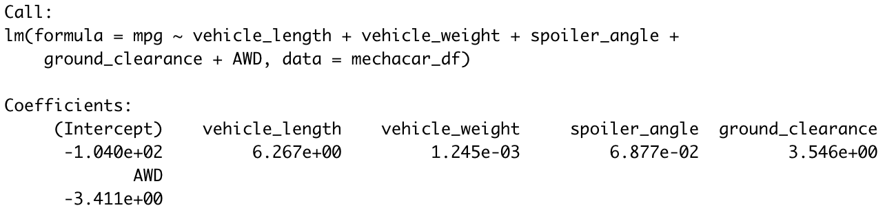
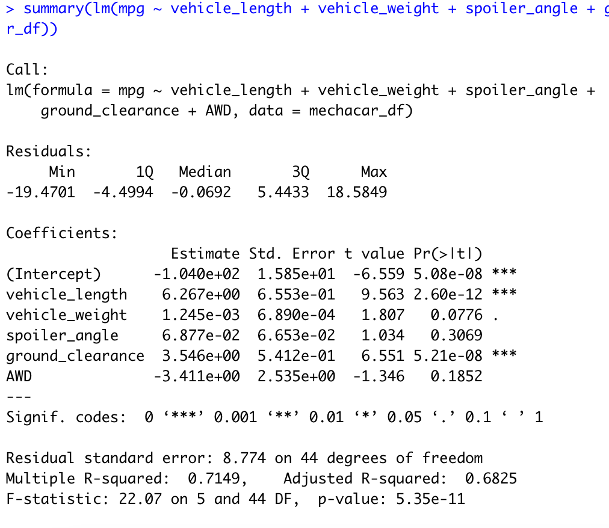
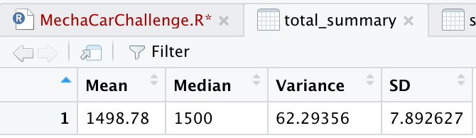
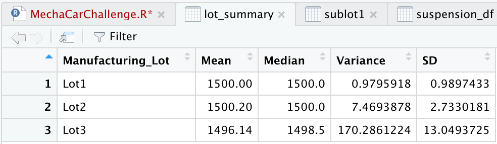
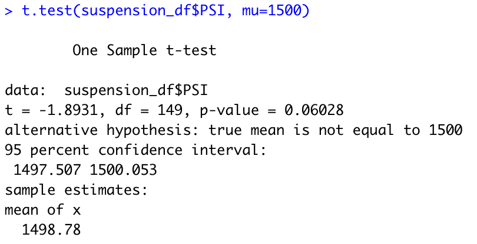
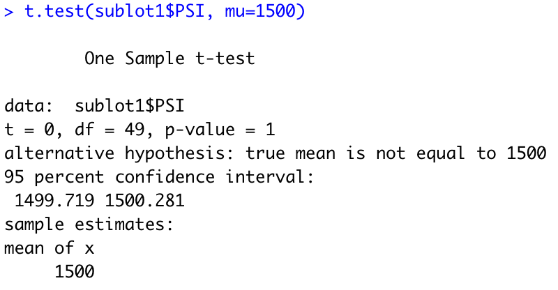
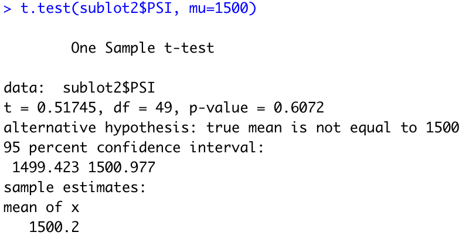
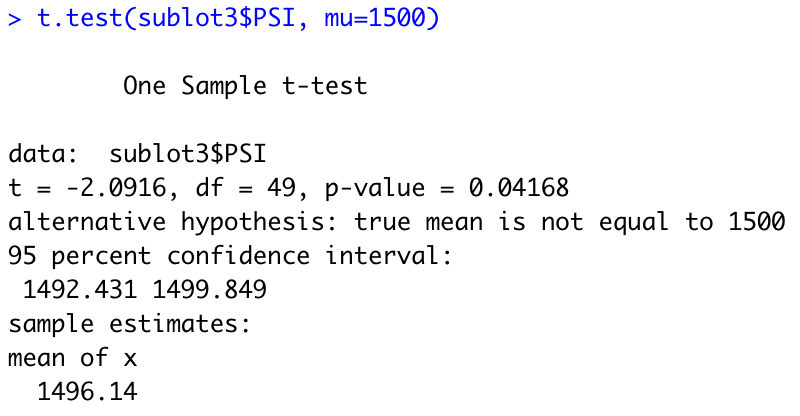

# MechaCar_Statistical_Analysis

## Linear Regression to Predict MPG

- Which variables/coefficients provided a non-random amount of variance to the mpg values in the dataset?

The variables that provided a non-random amount of variance to the mpg values were vehicle length, ground clearance, and the drivetrain (AWD vs 2WD). 

- Is the slope of the linear model considered to be zero? Why or why not?

The slope is not considered to be zero because some of the coefficients are non-zero. Vehicle length and ground clearance have a positive relationship with MPG, while the drivetrain has a negative relationship with MPG if the vehicle is AWD.

- Does this linear model predict mpg of MechaCar prototypes effectively? Why or why not?

The answer to that is no for the most part. There are a lot of components that can affect the MPG that are outside the observations. For instance, the number of cylinders in the engine and the fuel type can affect the MPG. If we are using the data, it is not logical that a truck that weighs 5,000 lbs has a better MPG than a car that weighs 2,500 lbs. 

## Summary Statistics on Suspension Coils

- The design specifications for the MechaCar suspension coils dictate that the variance of the suspension coils must not exceed 100 pounds per square inch. Does the current manufacturing data meet this design specification for all manufacturing lots in total and each lot individually? Why or why not?

When looking at the variance across all three lots, we see that the variance is 62.3 PSI, which is well below the 100 PSI requirement. When we look at the variance of Lot 1 and Lot 2, we see that it is well below the 100 PSI requirement. Lot 3 on the other hand does not meet that requirement. Lot 3's variance is 170.3 PSI, which is 70 PSI above the requirement.

## T-Tests on Suspension Coils

We performed a two-tailed t-test for all three lots combined and get that the p-value = 0.06028, which is greater than our alpha = 0.05, thus we fail to reject the null hypothesis and conclude that it is not statistically different from the population mean of 1,5000 PSI.

When we look at each lot individually, we see that:

- Lot 1 has a p-value = 1, which is greater than our alpha = 0.05, thus we fail to reject the null hypothesis and conclude that Lot 1 is not statistically different from the population mean of 1,5000 PSI.

- Lot 2 has a p-value = 0.6072, which is greater than our alpha = 0.05, thus we fail to reject the null hypothesis and conclude that Lot 2 is not statistically different from the population mean of 1,5000 PSI.

- Lot 3 has a p-value = 0.04168, which is less than our alpha = 0.05, thus we can reject the null hypothesis and conclude that Lot 3 is statistically different from the population mean of 1,5000 PSI.

## Study Design: MechaCar vs Competition

For this statistical test, I would use a one-tailed t-test. The metric I would use for the analysis is the MPG. 

The null and alternative hypothesis would be:

H0: MPGMechaCar = MPGCompetition

H1: MPGMechaCar > MPGCompetition

The data I would need is multiple run trials of the MechaCar and the best car company with a similar model and trim. For every trial, we would run the vehicle for exactly 20 miles, and then see what the MPG is. Vehicles have a better MPG when the it is traveling a long distance for a long period of time, non-stop.
